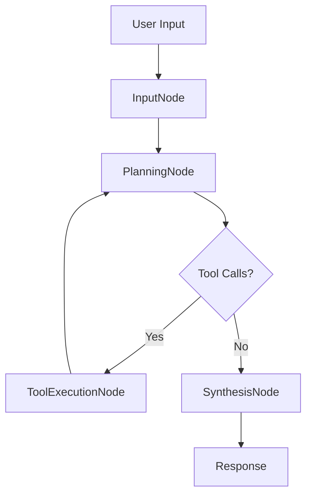

# LangGraph Agent Implementation

## 概要

`packages/agent/worker/graph/` ディレクトリに LangGraph ベースのエージェント実装を追加しました。この実装により、チャットエンドポイント (`/api/agent/chat`) が OpenAI の LLM と MCP サーバー管理ツールを統合したインテリジェントなエージェントとして動作します。

## アーキテクチャ

### ファイル構成

```
packages/agent/worker/graph/
├── index.ts          # グラフ構築とエクスポート
├── state.ts          # StateGraph の状態定義
├── nodes.ts          # ノード実装（input, planning, tool_execution, synthesis）
└── tools.ts          # 内蔵ツール（search_mcp_servers, add_mcp_server, etc.）
```

### ノード構成

1. **InputNode**: ユーザー入力を受け取り、システムプロンプトを追加
2. **PlanningNode**: OpenAI LLM を使用してタスクプランを生成し、必要なツールを特定
3. **ToolExecutionNode**: 必要な MCP ツールを逐次実行
4. **SynthesisNode**: ツール結果と履歴を統合して最終回答を生成

### 状態管理

```typescript
GraphAnnotation = {
  messages: BaseMessage[],      // 会話履歴
  mcpLinks: Array<...>,          // ユーザーにリンクされた MCP サーバー
  nextStep: string | null,       // 次のノード指定
  error: string | null,          // エラー情報
}
```

## 内蔵ツール

### 1. `search_mcp_servers`
MCP サーバーを検索します。

**入力:**
- `query` (optional): 検索クエリ
- `tags` (optional): フィルタリング用タグ
- `limit` (optional): 最大結果数

**出力:**
```json
{
  "items": [
    { "id": "...", "name": "...", "description": "..." }
  ]
}
```

### 2. `add_mcp_server`
MCP サーバーをユーザーのエージェントに追加します。

**入力:**
- `mcpServerId`: 追加する MCP サーバーの ID
- `config` (optional): サーバー固有の設定

**出力:**
```json
{
  "linkId": "...",
  "message": "MCP server successfully added"
}
```

### 3. `list_my_mcp_servers`
ユーザーにリンクされた MCP サーバー一覧を取得します。

**入力:**
- `includeDisabled` (optional): 無効化されたサーバーも含めるか

**出力:**
```json
{
  "items": [
    {
      "linkId": "...",
      "mcpServerId": "...",
      "enabled": true,
      "server": { ... }
    }
  ]
}
```

### 4. `remove_mcp_server`
MCP サーバーを無効化または削除します。

**入力:**
- `linkId`: 削除する MCP リンクの ID
- `hardDelete` (optional): 完全削除 (true) または無効化のみ (false)

**出力:**
```json
{
  "ok": true,
  "message": "MCP server disabled"
}
```

## 環境変数

### 必須
- `OPENAI_API_KEY`: OpenAI API キー（チャットエンドポイントで必須）

### オプション
- `MCP_BASE_URL`: MCP サーバーのベース URL（デフォルト: `http://localhost:8788`）
- `MCP_SERVICE_TOKEN`: MCP サーバーへのアクセストークン

### 設定方法

#### 開発環境
`.dev.vars` ファイルに追加:
```bash
OPENAI_API_KEY=sk-...
MCP_BASE_URL=http://localhost:8788
MCP_SERVICE_TOKEN=optional-token
```

#### 本番環境
Wrangler CLI を使用:
```bash
npx wrangler secret put OPENAI_API_KEY
```

## 使用例

### チャットリクエスト

```bash
POST /api/agent/chat
Authorization: Bearer <jwt-token>
Content-Type: application/json

{
  "input": "MCPサーバーを検索して"
}
```

### レスポンス

```json
{
  "sessionId": "...",
  "session": {
    "id": "...",
    "userId": "...",
    "createdAt": "...",
    "updatedAt": "..."
  },
  "messages": [
    {
      "id": "...",
      "role": "user",
      "content": "MCPサーバーを検索して",
      "createdAt": "..."
    },
    {
      "id": "...",
      "role": "assistant",
      "content": "search_mcp_servers ツールを使用して検索しました。以下のMCPサーバーが見つかりました...",
      "createdAt": "..."
    }
  ],
  "response": {
    "id": "...",
    "role": "assistant",
    "content": "...",
    "createdAt": "..."
  }
}
```

## フロー図



## チェックポイント戦略

- `AgentSession.graphState`: LangGraph の状態スナップショット（JSON）を保存
- `ConversationMessage`: 各ターンの会話履歴とツール出力を保存
- セッション再開時、前回のメッセージを復元してグラフを継続実行

## エラーハンドリング

### LLM エラー
- OpenAI API エラーは `agent_execution_failed` として返される
- エラーメッセージが `ConversationMessage` に保存される

### ツールエラー
- ツール実行エラーは ToolMessage として LLM にフィードバック
- LLM が代替プランを生成可能

### セッションエラー
- セッションが見つからない場合: `404 session_not_found`
- 認証エラー: `500 auth_context_missing`

## 制限事項

1. **ストリーミング未対応**: 現在 `stream: true` は未実装
2. **MCP プロトコル**: 現在は HTTP REST API のみサポート（SSE/WebSocket は将来実装）
3. **トークン制限**: OpenAI のトークン制限に依存

## 今後の拡張

1. **ストリーミングレスポンス**: SSE を使用したリアルタイム応答
2. **MCP ツール動的取得**: リンクされた MCP サーバーのツールを自動検出
3. **マルチモーダル対応**: 画像・音声入力のサポート
4. **並列ツール実行**: 複数ツールの並列実行による高速化
5. **チェックポイント永続化**: Durable Objects を使用した長期保存

## トラブルシューティング

### `openai_api_key_not_configured`
- `.dev.vars` に `OPENAI_API_KEY` を設定してください

### `agent_execution_failed`
- OpenAI API の制限を確認
- ログでスタックトレースを確認

### ツールが実行されない
- MCP サーバーが起動していることを確認（`npm run dev:mcp`）
- `MCP_BASE_URL` が正しいことを確認
