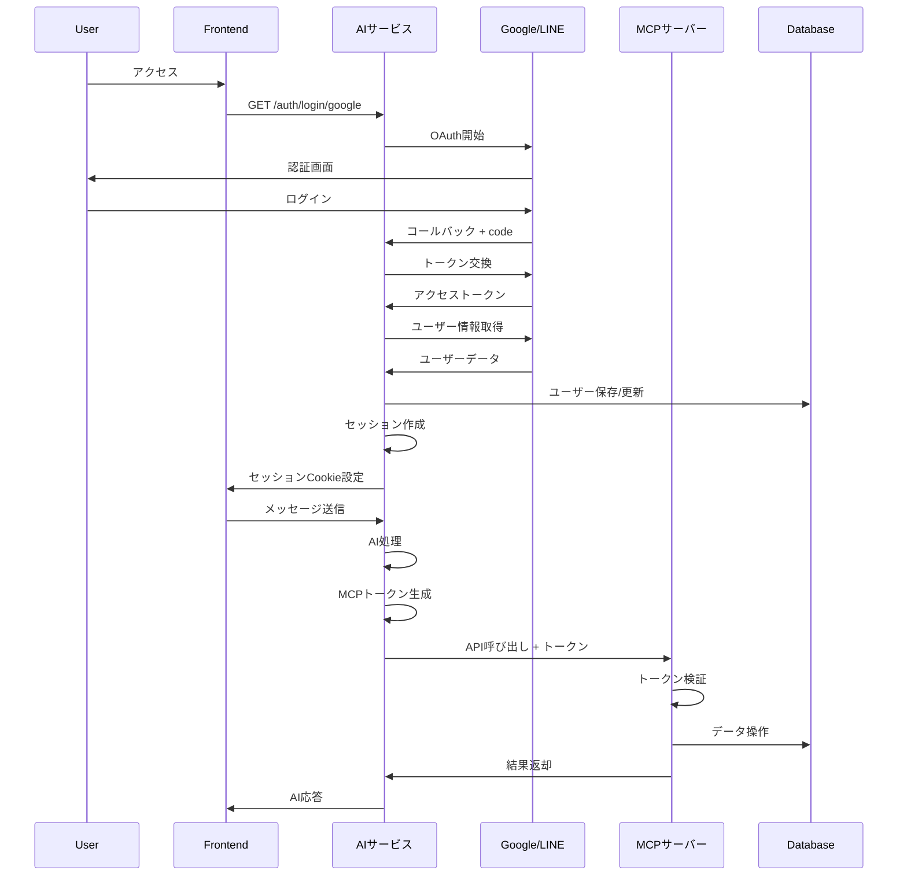
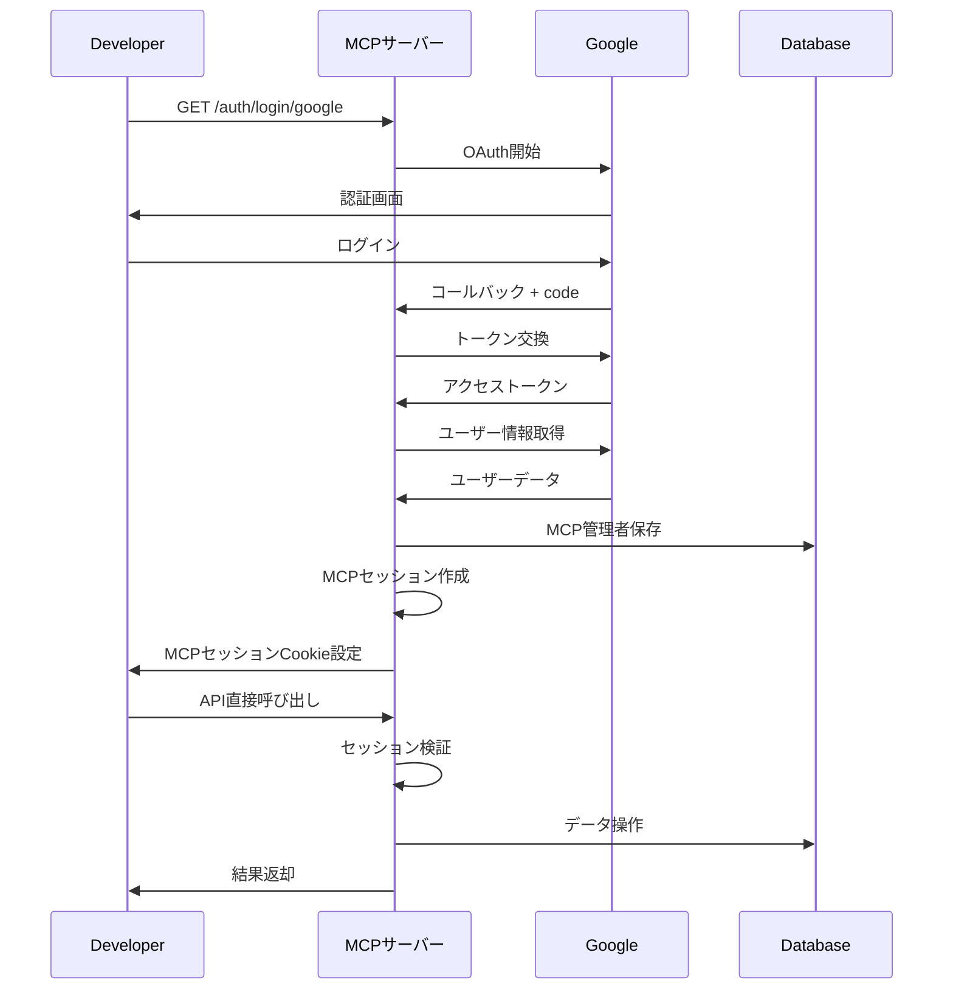

# 分離アーキテクチャの詳細設計

## 概要

AIサービスとMCPサーバーを完全に分離し、独立したデプロイメントと認証システムを持つアーキテクチャです。

## システム分離の理由

### 1. セキュリティの向上
- 各サービスが独立した認証システムを持つ
- 攻撃対象領域の最小化
- 権限の明確な分離

### 2. スケーラビリティ
- 各サービスを独立してスケール可能
- 負荷に応じた個別の最適化
- リソース使用の効率化

### 3. 保守性の向上
- 独立したデプロイメント
- サービスごとの開発サイクル
- 影響範囲の限定

### 4. 柔軟性
- MCPサーバーを複数のAIサービスで共有可能
- 異なる認証方式のサポート
- 将来的な拡張が容易

## デプロイメント構成

```
┌─────────────────────────────────────────────────────────────┐
│  Cloudflare Workers                                          │
│                                                              │
│  ┌──────────────────────────────────────────────────────┐  │
│  │  AIサービス (ai-service.example.com)                  │  │
│  │  - project: packages/agent                            │  │
│  │  - wrangler.toml: workers-1                           │  │
│  └──────────────────────────────────────────────────────┘  │
│                                                              │
│  ┌──────────────────────────────────────────────────────┐  │
│  │  MCPサーバー (mcp-api.example.com)                    │  │
│  │  - project: packages/mcp-server (新規作成)            │  │
│  │  - wrangler.toml: workers-2                           │  │
│  └──────────────────────────────────────────────────────┘  │
│                                                              │
└─────────────────────────────────────────────────────────────┘

┌─────────────────────────────────────────────────────────────┐
│  データベース (PostgreSQL)                                    │
│  - 共通データベースまたは分離                                  │
└─────────────────────────────────────────────────────────────┘
```

## プロジェクト構成

```
agent/
├── packages/
│   ├── agent/                 # AIサービス
│   │   ├── src/               # フロントエンド (SolidJS)
│   │   ├── worker/            # AIサービスWorker
│   │   │   ├── ai/            # LangGraph AI Agent
│   │   │   ├── api/           # REST API
│   │   │   ├── auth/          # Google/LINE OAuth
│   │   │   │   └── mcp-token.ts  # MCPトークン発行
│   │   │   └── payment/       # Stripe決済
│   │   ├── wrangler.toml      # Workers設定
│   │   └── .dev.vars          # 環境変数
│   │
│   ├── mcp-server/            # MCPサーバー (新規)
│   │   ├── worker/            # MCPサーバーWorker
│   │   │   ├── auth/          # MCP独自Google OAuth
│   │   │   │   ├── google.ts     # 管理者認証
│   │   │   │   └── verify.ts     # トークン検証
│   │   │   ├── mcp/           # MCP Tools
│   │   │   │   ├── middleware.ts # 認証ミドルウェア
│   │   │   │   └── tools/        # 各種ツール
│   │   │   │       ├── booking.ts
│   │   │   │       ├── product.ts
│   │   │   │       ├── order.ts
│   │   │   │       └── form.ts
│   │   │   └── index.ts       # エントリーポイント
│   │   ├── wrangler.toml      # Workers設定
│   │   ├── package.json
│   │   └── .dev.vars          # 環境変数
│   │
│   └── database/              # 共通データベース
│       └── prisma/
│           └── schema.prisma  # 統合スキーマ
```

## 認証フロー詳細

### 1. エンドユーザーのフロー



### 2. 開発者/管理者のフロー



## トークン設計

### AIサービストークン (JWT)

```json
{
  "header": {
    "alg": "RS256",
    "typ": "JWT"
  },
  "payload": {
    "iss": "ai-service.example.com",
    "sub": "usr_123456",
    "aud": "mcp-api.example.com",
    "exp": 1696300800,
    "iat": 1696297200,
    "scope": ["booking:create", "booking:read", "product:read"],
    "user": {
      "id": "usr_123456",
      "email": "user@example.com",
      "name": "John Doe"
    }
  },
  "signature": "..."
}
```

### スコープの定義

| スコープ | 説明 |
|---------|------|
| `booking:read` | 予約情報の読み取り |
| `booking:create` | 予約の作成 |
| `booking:update` | 予約の更新 |
| `booking:delete` | 予約の削除 |
| `product:read` | 商品情報の読み取り |
| `order:create` | 注文の作成 |
| `order:read` | 注文情報の読み取り |
| `form:read` | フォームの読み取り |
| `form:submit` | フォーム送信 |

## データベース設計

### オプション1: 共通データベース(推奨)

```prisma
// AIサービス用テーブル
model User {
  id         String   @id @default(cuid())
  email      String   @unique
  name       String
  provider   String   // "google" or "line"
  providerId String
  createdAt  DateTime @default(now())
  
  sessions      Session[]
  conversations Conversation[]
  mcpTokens     McpAccessToken[]
  
  @@map("users")
}

model McpAccessToken {
  id        String   @id @default(cuid())
  userId    String
  user      User     @relation(fields: [userId], references: [id])
  token     String   @unique
  scope     String[]
  expiresAt DateTime
  createdAt DateTime @default(now())
  
  @@map("mcp_access_tokens")
}

// MCPサーバー用テーブル
model McpUser {
  id         String   @id @default(cuid())
  email      String   @unique
  name       String
  provider   String   // "google"
  providerId String
  role       String   @default("admin")
  createdAt  DateTime @default(now())
  
  sessions McpSession[]
  
  @@map("mcp_users")
}

// 共有データテーブル
model Booking {
  id          String   @id @default(cuid())
  userId      String?  // AIサービスのUser.id
  serviceId   String
  date        DateTime
  status      String
  createdBy   String   // "ai-service" or "mcp"
  createdAt   DateTime @default(now())
  
  @@map("bookings")
}
```

### オプション2: 分離データベース

AIサービスとMCPサーバーで別々のデータベースを使用する場合:

- AIサービス: ユーザー、セッション、会話履歴
- MCPサーバー: ビジネスデータ(予約、商品、注文、フォーム)
- API経由でデータ連携

## セキュリティ対策

### 1. トークン検証

```typescript
// MCPサーバー側
export async function verifyAiServiceToken(token: string) {
  try {
    // JWT検証
    const payload = await jose.jwtVerify(
      token,
      await importPublicKey(AI_SERVICE_PUBLIC_KEY),
      {
        issuer: 'ai-service.example.com',
        audience: 'mcp-api.example.com'
      }
    );
    
    // 有効期限チェック
    if (payload.exp && payload.exp < Date.now() / 1000) {
      throw new Error('Token expired');
    }
    
    // スコープチェック
    const scope = payload.scope as string[];
    if (!scope || scope.length === 0) {
      throw new Error('Invalid scope');
    }
    
    return {
      userId: payload.sub,
      scope,
      user: payload.user
    };
  } catch (error) {
    throw new Error('Invalid token');
  }
}
```

### 2. スコープベースのアクセス制御

```typescript
// MCPサーバー側
export function requireScope(requiredScope: string): MiddlewareHandler {
  return async (c, next) => {
    const scope = c.get('scope') as string[];
    
    if (!scope || !scope.includes(requiredScope)) {
      return c.json({ error: 'Insufficient permissions' }, 403);
    }
    
    await next();
  };
}

// 使用例
app.post('/mcp/tools/booking/create', 
  verifyAiServiceToken,
  requireScope('booking:create'),
  async (c) => {
    // 予約作成処理
  }
);
```

### 3. レート制限

```typescript
// ユーザーごとのレート制限
const rateLimiter = new Map<string, { count: number; resetAt: number }>();

export function rateLimit(maxRequests: number, windowMs: number): MiddlewareHandler {
  return async (c, next) => {
    const userId = c.get('userId');
    const now = Date.now();
    
    const userLimit = rateLimiter.get(userId);
    
    if (!userLimit || userLimit.resetAt < now) {
      rateLimiter.set(userId, { count: 1, resetAt: now + windowMs });
    } else if (userLimit.count >= maxRequests) {
      return c.json({ error: 'Rate limit exceeded' }, 429);
    } else {
      userLimit.count++;
    }
    
    await next();
  };
}
```

## 開発環境セットアップ

### 1. プロジェクト作成

```bash
# MCPサーバープロジェクト作成
cd packages
mkdir mcp-server
cd mcp-server
npm init -y

# 依存関係インストール
npm install hono arctic jose @prisma/client
npm install -D @cloudflare/workers-types wrangler typescript
```

### 2. wrangler.toml設定

```toml
# packages/mcp-server/wrangler.toml
name = "mcp-server"
main = "worker/index.ts"
compatibility_date = "2024-01-01"

[observability]
enabled = true

[[d1_databases]]
binding = "DB"
database_name = "mcp-database"
database_id = "your-database-id"
```

### 3. 開発サーバー起動

```bash
# AIサービス (ポート8787)
cd packages/agent
npm run dev

# MCPサーバー (ポート8788)
cd packages/mcp-server
wrangler dev --port 8788
```

## デプロイ

### AIサービス

```bash
cd packages/agent
wrangler deploy
```

### MCPサーバー

```bash
cd packages/mcp-server

# Secrets設定
wrangler secret put MCP_GOOGLE_CLIENT_SECRET
wrangler secret put AI_SERVICE_PUBLIC_KEY
wrangler secret put DATABASE_URL

# デプロイ
wrangler deploy
```

## モニタリング

### Cloudflare Analytics

- リクエスト数
- エラー率
- レスポンスタイム
- 帯域幅使用量

### カスタムログ

```typescript
// 構造化ログ
console.log(JSON.stringify({
  timestamp: new Date().toISOString(),
  service: 'mcp-server',
  event: 'token_verified',
  userId: payload.sub,
  scope: payload.scope
}));
```

## トラブルシューティング

### トークン検証エラー

1. 公開鍵と秘密鍵のペアを確認
2. トークンの有効期限をチェック
3. 発行者(issuer)が正しいか確認

### CORS エラー

1. MCPサーバーの許可リストにAIサービスを追加
2. プリフライトリクエストの処理を確認

### データベース接続エラー

1. 接続文字列を確認
2. IPホワイトリストを確認(該当する場合)

## 参考資料

- [MCP_AUTH.md](../guides/MCP_AUTH.md) - 認証システムの詳細
- [AUTH_INTEGRATION.md](../guides/AUTH_INTEGRATION.md) - AIサービス認証
- [Cloudflare Workers Docs](https://developers.cloudflare.com/workers/)
- [Hono Documentation](https://hono.dev/)
